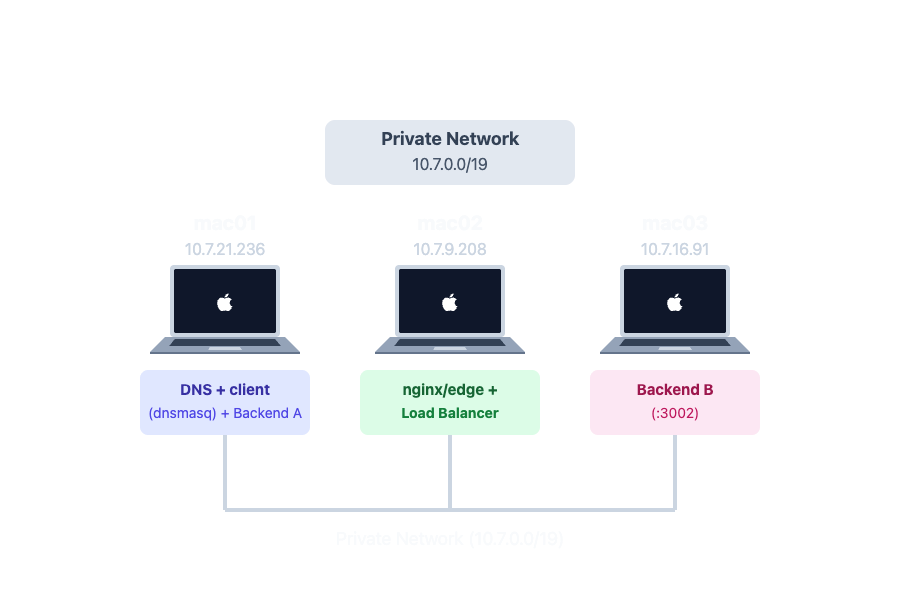
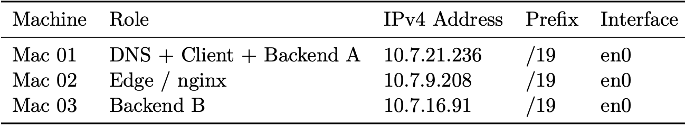
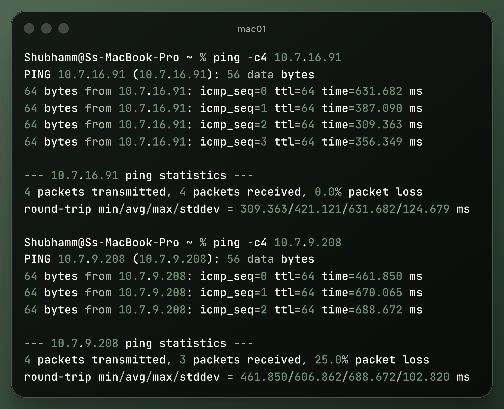
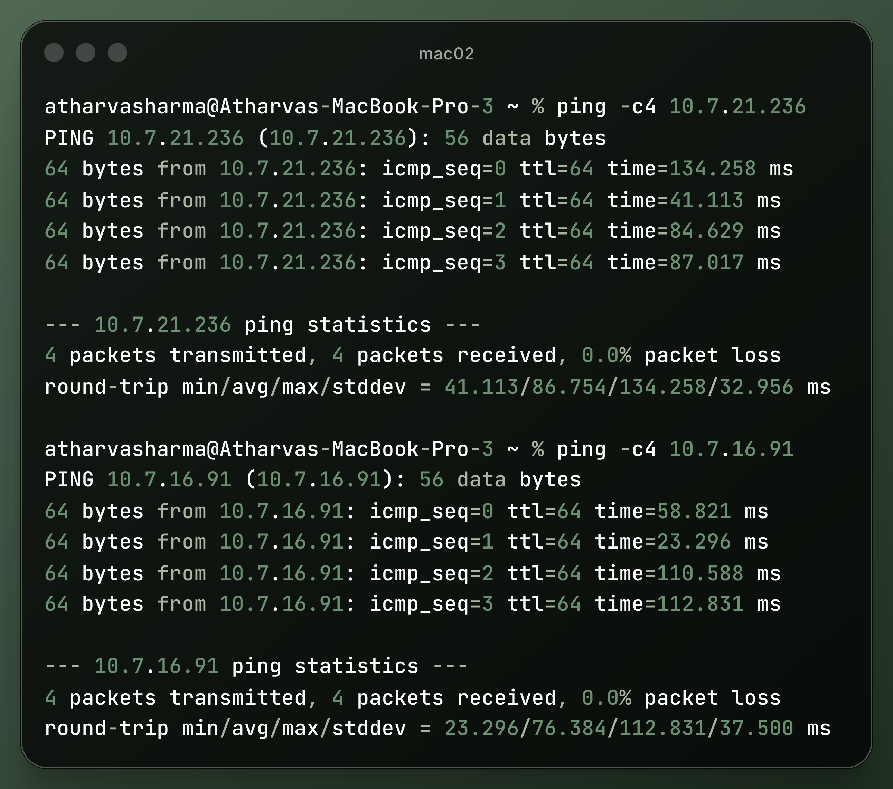
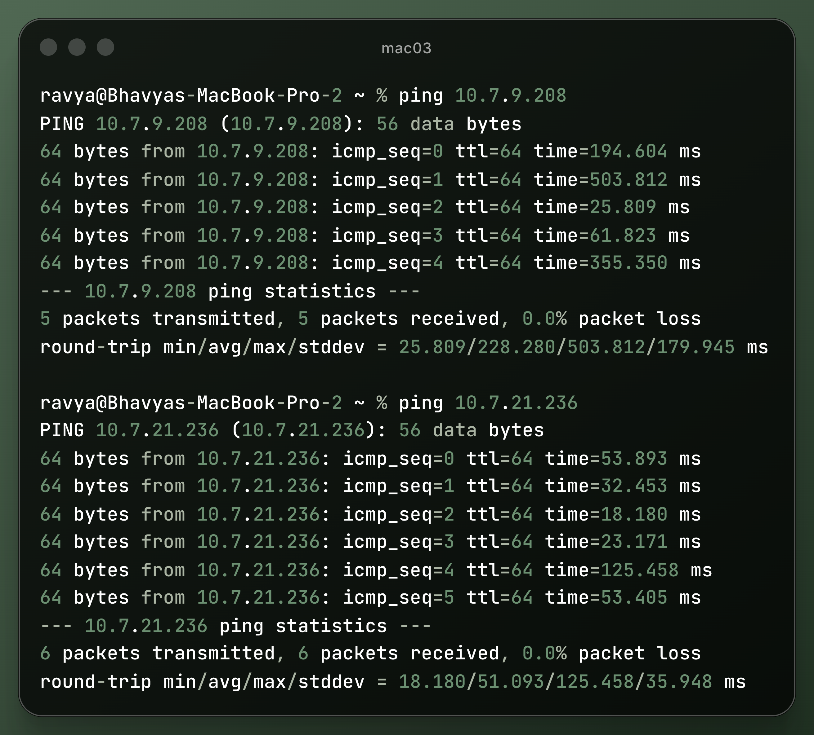

# Task A: Private LAN Architecture & Network Topology

This directory documents the physical and logical network architecture established for **Phase 1** across three macOS laptops on an isolated private local area network.

---

## 1. Network Addressing & Node Inventory

- **Network Subnet:** `10.7.0.0/19`
- **Subnet Mask:** `255.255.224.0`
- **Default Gateway:** `10.7.0.1`

| Machine | Member | IPv4 Address | Prefix | Interface | MAC Address | Assigned Roles |
|---|---|---|---|---|---|---|
| **Mac 01** | Shubham Aggarwal | `10.7.21.236` | `/19` | `en0` | `80:a9:97:3d:bd:de` | Private DNS Server (`dnsmasq`), Test Client, Backend A (`:3001`) |
| **Mac 02** | Atharva Sharma | `10.7.9.208` | `/19` | `en0` | `ae:8a:c0:6b:6f:c8` | Nginx Edge, Reverse Proxy, Round-Robin Load Balancer, TLS Termination (`:8080`, `:8443`) |
| **Mac 03** | Bhavya Punj | `10.7.16.91` | `/19` | `en0` | `22:53:52:98:cf:c9` | Backend B (`:3002`), Test Client |

---

## 2. Network Topology

The machines communicate locally over Wi-Fi/LAN. External client traffic hits Mac 02 (the edge gateway), which proxies requests to the upstream backends on Mac 01 and Mac 03.

---

## 3. IP Inventory Asset

---

## 4. Full Inter-Node Reachability (Ping Tests)

Layer 3 network reachability was systematically verified across all node pairs before deploying application services.

### 4.1 Mac 01 Reachability (to Mac 02 and Mac 03)

### 4.2 Mac 02 Reachability (to Mac 01 and Mac 03)

### 4.3 Mac 03 Reachability (to Mac 01 and Mac 02)

