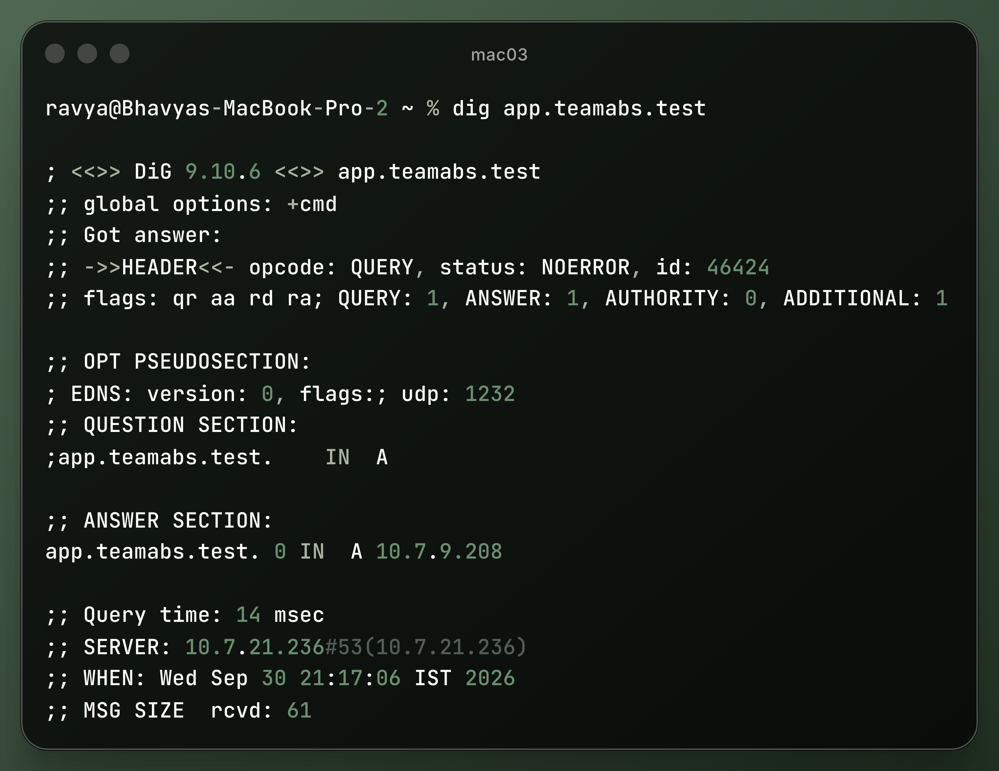
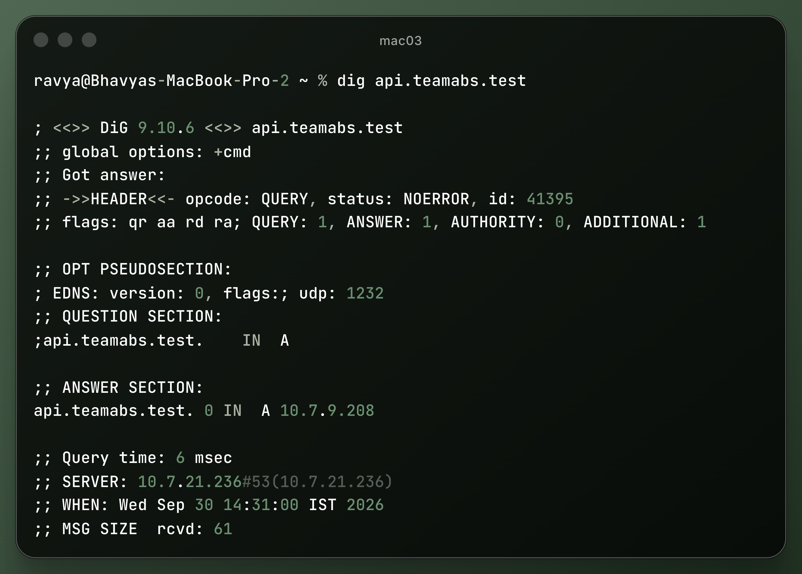
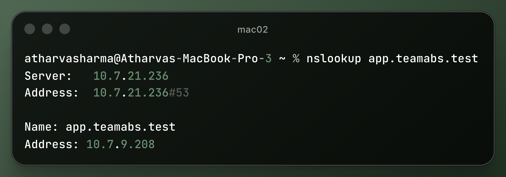
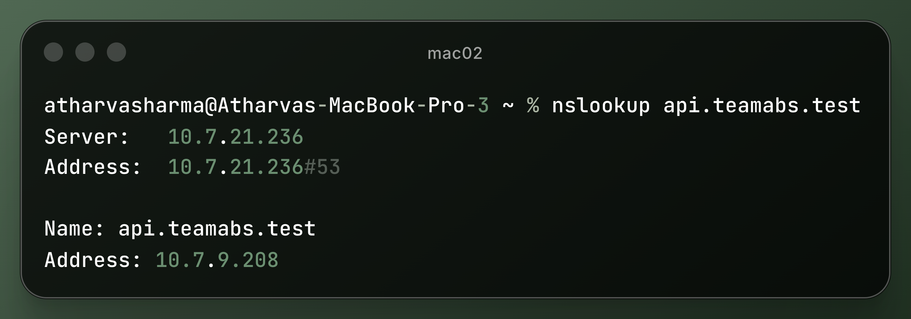

# Task B: Private DNS Infrastructure

This directory contains the DNS configuration and resolution verification records for **Phase 1**.

---

## 1. Overview & Machine Configuration

Mac 01 (`10.7.21.236`) acts as the private DNS resolver for the internal domain using `dnsmasq`.

- **Configuration File:** [`dnsmasq.conf`](dnsmasq.conf)
- **Listening Interface:** `en0` (`10.7.21.236`)
- **DNS Port:** `53` (UDP/TCP)
- **Domain Records:**
  - `app.teamabs.test` &rarr; `10.7.9.208` (Mac 02 Nginx Edge)
  - `api.teamabs.test` &rarr; `10.7.9.208` (Mac 02 Nginx Edge)
- **Upstream Forwarding:** Queries outside the project domain forward to `1.1.1.1` and `8.8.8.8`.

---

## 2. Running the DNS Server

On **Mac 01**:
```bash
sudo dnsmasq -C dnsmasq.conf -d
```

### Setting Client DNS Resolvers
On **Mac 02** and **Mac 03**:
```bash
sudo networksetup -setdnsservers Wi-Fi 10.7.21.236
networksetup -getdnsservers Wi-Fi
```

---

## 3. DNS Resolution Evidence

### 3.1 Verification via `dig`
```bash
dig app.teamabs.test
dig api.teamabs.test
```



### 3.2 Verification via `nslookup`
```bash
nslookup app.teamabs.test
nslookup api.teamabs.test
```



---

## 4. Key Concept: DNS Resolution vs TCP/HTTPS Connection

- **DNS Resolution (Layer 7 / UDP 53):** A directory lookup translating human-readable domain names (`app.teamabs.test`) into an IP address (`10.7.9.208`). No connection to the web service occurs here.
- **TCP Connection (Layer 4 / Port 8443):** The client initiates a 3-way handshake (`SYN` &rarr; `SYN-ACK` &rarr; `ACK`) with the IP address discovered via DNS.
- **TLS / HTTPS (Layer 7 over Layer 4):** Once the TCP connection is established, cryptographic handshaking occurs to exchange certificates and encrypt subsequent HTTP traffic.
