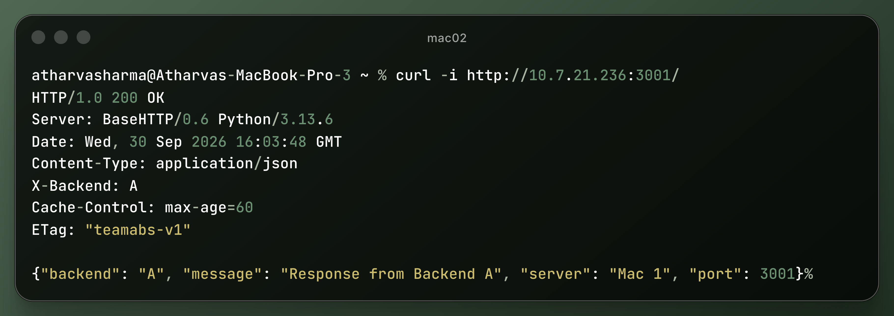
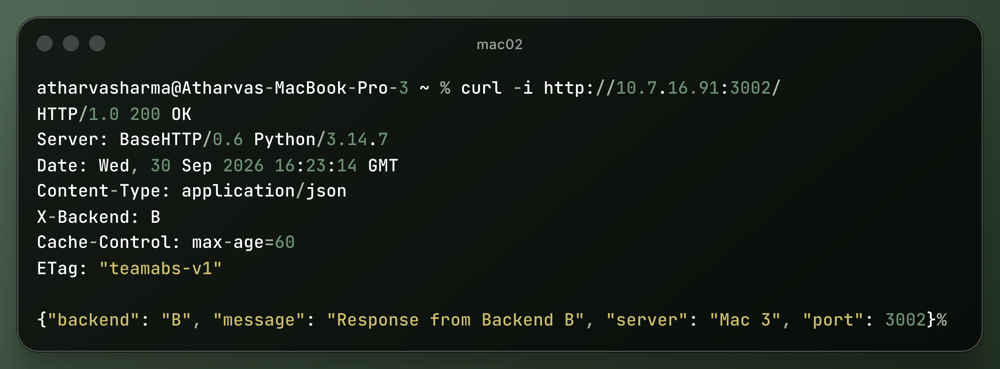

# Task C: Backend Services (Backend A & Backend B)

This directory contains the Python HTTP/REST microservice implementations deployed across two separate physical machines.

---

## 1. Backend Specifications

| Property | Backend A | Backend B |
|---|---|---|
| **Host Machine** | Mac 01 (`10.7.21.236`) | Mac 03 (`10.7.16.91`) |
| **Owner** | Shubham Aggarwal | Bhavya Punj |
| **Source File** | [`backend_A/server.py`](backend_A/server.py) | [`Backend_B/server.py`](Backend_B/server.py) |
| **Port** | `3001` | `3002` |
| **Bind Address** | `0.0.0.0` (all interfaces) | `0.0.0.0` (all interfaces) |
| **Response Header** | `X-Backend: A` | `X-Backend: B` |
| **Cache Headers** | `Cache-Control: max-age=60`, `ETag: "teamabs-v1"` | `Cache-Control: max-age=60`, `ETag: "teamabs-v1"` |

---

## 2. API Endpoints

- **`GET /`**:
  Returns service status confirmation JSON:
  ```json
  {"backend": "A", "message": "Response from Backend A", "server": "Mac 1", "port": 3001}
  ```
- **`GET /api/status`**:
  Returns health status JSON:
  ```json
  {"backend": "A", "status": "healthy", "server": "Mac 1", "port": 3001}
  ```
- **Conditional `If-None-Match: "teamabs-v1"`**:
  Returns `HTTP 304 Not Modified` with no response body.

---

## 3. Running & Verifying Backends

### Start Backend A (Mac 01):
```bash
python3 03_Backends/backend_A/server.py
```

### Start Backend B (Mac 03):
```bash
python3 03_Backends/Backend_B/server.py
```

### Direct Verification Evidence:
- **Backend A Direct Response (`http://10.7.21.236:3001/`):**
  
- **Backend B Direct Response (`http://10.7.16.91:3002/`):**
  
