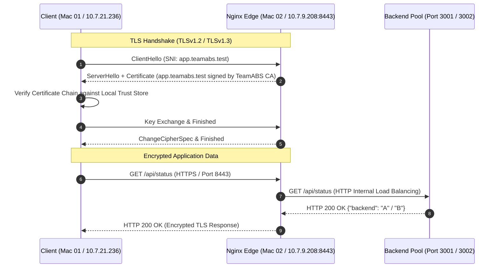

# Task E: Transport Layer Security (TLS/HTTPS)

This directory documents the Public Key Infrastructure (PKI) setup, OpenSSL certificate generation, and Nginx reverse proxy SSL/TLS termination for the TeamABS network architecture.

---

## 1. TLS Architecture & PKI Overview

To secure client communication without relying on third-party commercial Certificate Authorities (CAs), TeamABS implemented a two-tier PKI model:
1. **Root Certificate Authority (CA):** Generated offline to serve as the local trust anchor (`TeamABS Root CA`).
2. **Server Certificate with SAN:** Issued specifically for `app.teamabs.test` using Subject Alternative Name (SAN) extensions (`san.cnf`) required by modern TLS stacks (RFC 2818 / macOS / Chrome).
3. **Client Trust Store:** The Root CA was imported and explicitly trusted in the macOS System Keychain on the client machine (Mac 01), enabling strict, trusted TLS verification without `-k` (`--insecure`).



---

## 2. OpenSSL Certificate Generation Steps

### Step 1: Generate Root CA Private Key and Certificate
```bash
# Generate Root CA private key
openssl genrsa -out rootCA.key 4096

# Generate Root CA self-signed certificate (valid 365 days)
openssl req -x509 -new -nodes -key rootCA.key -sha256 -days 365 \
  -out rootCA.crt \
  -subj "/C=IN/ST=Haryana/L=Sonepat/O=TeamABS/OU=CN Project/CN=TeamABS Root CA"
```

### Step 2: Generate Server Private Key and CSR with SAN
Modern TLS requires Subject Alternative Names (`subjectAltName`). Configuration is defined in [`san.cnf`](san.cnf):
```ini
[req]
distinguished_name = req_distinguished_name
x509_extensions = v3_req
prompt = no

[req_distinguished_name]
C = IN
ST = Haryana
L = Sonepat
O = TeamABS
OU = CN Project
CN = app.teamabs.test

[v3_req]
subjectAltName = @alt_names

[alt_names]
DNS.1 = app.teamabs.test
```

Generate the private key and Certificate Signing Request (CSR):
```bash
# Generate server private key
openssl genrsa -out app.teamabs.test.key 2048

# Generate CSR using san.cnf
openssl req -new -key app.teamabs.test.key -out app.teamabs.test.csr -config san.cnf
```

### Step 3: Sign Server Certificate with Root CA
```bash
openssl x509 -req -in app.teamabs.test.csr \
  -CA rootCA.crt -CAkey rootCA.key -CAcreateserial \
  -out app.teamabs.test.crt -days 365 -sha256 \
  -extfile san.cnf -extensions v3_req
```

### Step 4: Install and Trust Root CA in Client Keychain (macOS)
```bash
sudo security add-trusted-cert -d -r trustRoot \
  -k /Library/Keychains/System.keychain rootCA.crt
```

---

## 3. Nginx TLS Configuration

TLS termination is handled on Mac 02 (port 8443) via [`nginx_tls.conf`](nginx_tls.conf):
```nginx
upstream teamabs_backends {
    server 10.7.21.236:3001;
    server 10.7.16.91:3002;
}

server {
    listen 8443 ssl;
    server_name app.teamabs.test;

    ssl_certificate     /opt/homebrew/etc/nginx/ssl/app.teamabs.test.crt;
    ssl_certificate_key /opt/homebrew/etc/nginx/ssl/app.teamabs.test.key;

    ssl_protocols TLSv1.2 TLSv1.3;
    ssl_ciphers HIGH:!aNULL:!MD5;

    location / {
        proxy_pass http://teamabs_backends;

        proxy_set_header Host $host;
        proxy_set_header X-Real-IP $remote_addr;
        proxy_set_header X-Forwarded-For $proxy_add_x_forwarded_for;
        proxy_set_header X-Forwarded-Proto $scheme;
    }
}
```

---

## 4. Verification & Testing

### Trusted HTTPS Request (No `-k` flag)
```bash
curl -iv https://app.teamabs.test:8443/api/status
```
**Expected Output:**
- `* Server certificate: subject: C=IN, ST=Haryana, L=Sonepat, O=TeamABS, OU=CN Project, CN=app.teamabs.test`
- `* Server certificate: issuer: C=IN, ST=Haryana, L=Sonepat, O=TeamABS, OU=CN Project, CN=TeamABS Root CA`
- `* SSL certificate verify ok.`
- `HTTP/1.1 200 OK`
