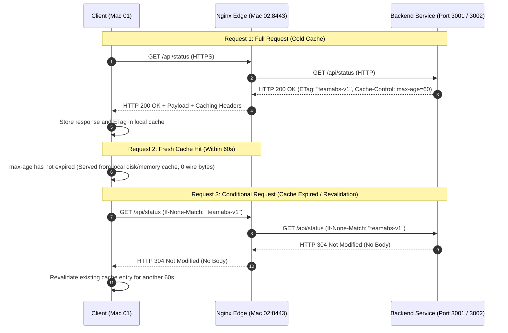
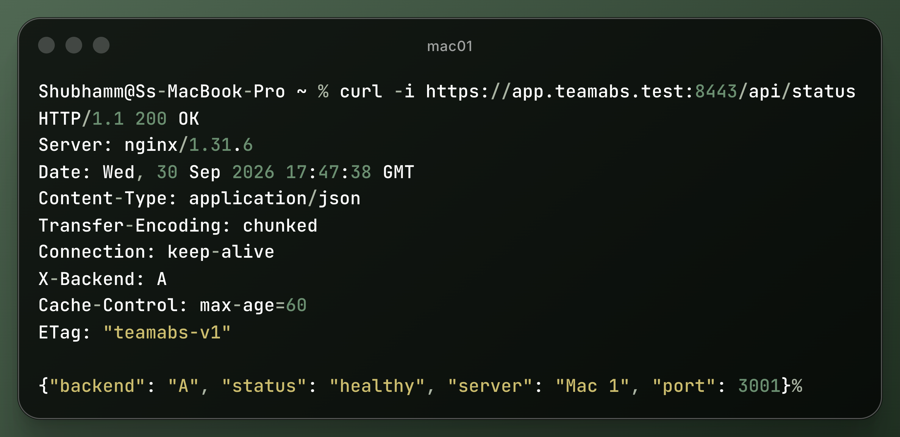
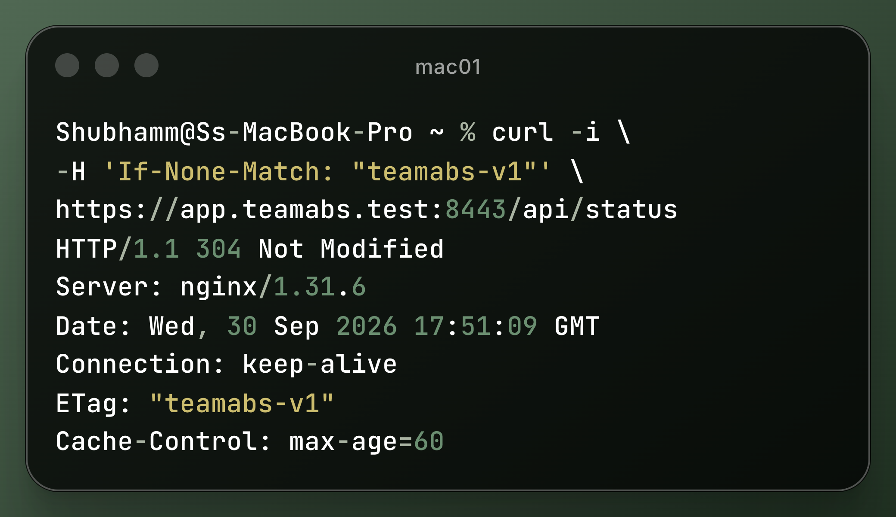

# Task F: HTTP Caching & Conditional Revalidation

This directory documents the implementation and verification of HTTP caching mechanisms, response headers, and conditional validation (`ETag` / `If-None-Match`) across the TeamABS distributed network.

---

## 1. Overview & Caching Mechanics

Both backend services (`Backend A` on Mac 01 and `Backend B` on Mac 03) implement RFC 7234 compliant HTTP caching headers on all responses served via `/api/status`:
* **`Cache-Control: max-age=60`**: Instructs clients and intermediary caches that the response is fresh for 60 seconds from generation time.
* **`ETag: "teamabs-v1"`**: An entity tag providing a cryptographic or version validator for the representation state.



---

## 2. Technical Comparison: Caching Behaviors

| Behavior | Trigger Condition | Wire Traffic | Server Body Sent | HTTP Status |
| :--- | :--- | :--- | :--- | :--- |
| **Fresh Cache Hit** | Request within `max-age=60` window | **0 bytes** (client-side only) | No | `200 OK` (from cache) |
| **Conditional Request** | Cache stale or client revalidates with `If-None-Match: "teamabs-v1"` | Headers only | **No** (empty body) | `304 Not Modified` |
| **Full New Request** | Cache empty, bypassed, or validator mismatch | Full request & response | **Yes** (full JSON payload) | `200 OK` |

---

## 3. Verification & Evidence

### 1. Direct Backend Verification
```bash
# Backend A (Port 3001)
curl -i http://localhost:3001/api/status | grep -Ei 'HTTP/|Cache-Control:|ETag:'
# Output:
# HTTP/1.0 200 OK
# Cache-Control: max-age=60
# ETag: "teamabs-v1"

# Backend B (Port 3002)
curl -i http://localhost:3002/api/status | grep -Ei 'HTTP/|Cache-Control:|ETag:'
# Output:
# HTTP/1.0 200 OK
# Cache-Control: max-age=60
# ETag: "teamabs-v1"
```

### 2. Edge Verification via Nginx HTTPS (Port 8443)
```bash
curl -i https://app.teamabs.test:8443/api/status
```


**Observed Response:**
```http
HTTP/1.1 200 OK
Server: nginx/1.31.6
Date: Wed, 30 Sep 2026 17:47:38 GMT
Content-Type: application/json
Transfer-Encoding: chunked
Connection: keep-alive
X-Backend: A
Cache-Control: max-age=60
ETag: "teamabs-v1"

{"backend": "A", "status": "healthy", "server": "Mac 1", "port": 3001}
```

---

### 3. Conditional Request Verification (`If-None-Match`)
```bash
curl -i -H 'If-None-Match: "teamabs-v1"' https://app.teamabs.test:8443/api/status
```


**Observed Response:**
```http
HTTP/1.1 304 Not Modified
Server: nginx/1.31.6
Date: Wed, 30 Sep 2026 17:51:09 GMT
Connection: keep-alive
ETag: "teamabs-v1"
Cache-Control: max-age=60
```

---

## 4. Associated Artifacts

- [`cache_headers.txt`](cache_headers.txt): Raw console outputs and terminal logs for direct and proxied test runs.
- [`cache_headers_response.png`](cache_headers_response.png): Screenshot showing successful receipt of `Cache-Control` and `ETag`.
- [`cache_conditional_304.png`](cache_conditional_304.png): Screenshot demonstrating `HTTP 304 Not Modified` return when validator matches.
