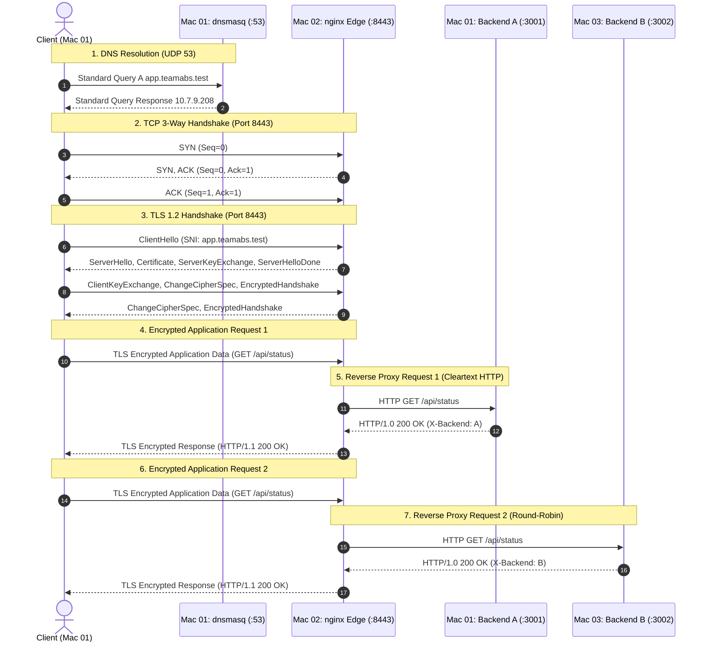

# Wireshark Filters & Packet Capture Reference

This directory contains packet capture (`.pcapng`) files and documentation of all display and capture filters utilized across **Phase 1** testing to verify DNS resolution, TCP handshakes, TLS 1.2 negotiation, encrypted payloads, and reverse proxy backend forwarding.

---

## 1. Included Packet Capture Files & Filter Mapping

Below is the exact mapping of which filter to apply to each packet capture file:

| Capture File | Purpose / What It Proves | Display Filter to Apply | Ready-to-Run `tshark` Command |
|---|---|---|---|
| **`nginx_backend_load_balancing.pcapng`** | Proves nginx load balancing between Backend A & B | `tcp.port == 3001 || tcp.port == 3002` | `tshark -r 07_Wireshark/nginx_backend_load_balancing.pcapng -Y "tcp.port == 3001 \|\| tcp.port == 3002"` |
| **`tls12_handshake_and_traffic.pcapng`** | Proves full TLS 1.2 handshake and encrypted data | `tls \|\| tcp.port == 8443` | `tshark -r 07_Wireshark/tls12_handshake_and_traffic.pcapng -Y "tls \|\| tcp.port == 8443"` |
| **`tls_certificate_exchange.pcapng`** | Isolates server certificate transmission (`app.teamabs.test`) | `tls.handshake.type == 11` | `tshark -r 07_Wireshark/tls_certificate_exchange.pcapng -Y "tls.handshake.type == 11"` |
| **`tcp_tls_handshake.pcapng`** | Layer 4 TCP 3-way handshake before TLS tunnel | `tcp.flags.syn == 1 \|\| tls.handshake` | `tshark -r 07_Wireshark/tcp_tls_handshake.pcapng -Y "tcp.flags.syn == 1 \|\| tls.handshake"` |

### File-by-File Breakdown:

1. **`nginx_backend_load_balancing.pcapng`**:
   - **What it captures:** nginx (`10.7.9.208`) forwarding incoming client traffic to Backend A (`10.7.21.236:3001`) and Backend B (`10.7.16.91:3002`) over cleartext HTTP with `HTTP/1.0 200 OK` JSON responses.
   - **Filters to run:**
     - Isolate backend traffic: `tcp.port == 3001 || tcp.port == 3002`
     - Inspect HTTP request/response payloads: `http.request || http.response`
     - Track alternating server IP destinations: `ip.dst == 10.7.21.236 || ip.dst == 10.7.16.91`

2. **`tls12_handshake_and_traffic.pcapng`**:
   - **What it captures:** Complete TLS 1.2 encrypted connection on port `8443` including `Client Hello`, `Server Hello`, `Certificate`, `Server Key Exchange`, and opaque `Application Data`.
   - **Filters to run:**
     - Overall TLS conversation: `tls`
     - TCP handshake & TLS combined: `tcp.port == 8443`
     - Isolate encrypted application packets only: `tls.record.content_type == 23`

3. **`tls_certificate_exchange.pcapng`**:
   - **What it captures:** Dedicated frame where nginx transmits its signed X.509 server certificate (`CN=app.teamabs.test`) to the client.
   - **Filters to run:**
     - Target Certificate message: `tls.handshake.type == 11`
     - Full handshake: `tls.handshake`

4. **`tcp_tls_handshake.pcapng`**:
   - **What it captures:** Initial SYN, SYN-ACK, ACK packet exchange establishing the TCP socket followed by ClientHello.
   - **Filters to run:**
     - Handshake SYN packets: `tcp.flags.syn == 1`
     - TCP socket connection: `tcp.port == 8443`

---

## 2. End-to-End Protocol Sequence Flow



---

## 3. Quick Filter Cheat Sheet

| Purpose | Wireshark Display Filter | Description |
|---|---|---|
| **DNS Resolution** | `dns` or `udp.port == 53` | All DNS queries and responses on port 53 |
| **Project Domain Query** | `dns.qry.name == "app.teamabs.test"` | Filters queries targeting the project hostname |
| **TCP 3-Way Handshake** | `tcp.port == 8443 and tcp.flags.syn == 1` | SYN and SYN-ACK packets initiating TLS connection |
| **All TLS Traffic** | `tls` or `ssl` | All TLS protocol records (handshake, change cipher, alert, data) |
| **TLS Handshake Only** | `tls.handshake` | Isolates negotiation phases (ClientHello, ServerHello, Cert, Key Exchange) |
| **ClientHello** | `tls.handshake.type == 1` | Isolates cipher suite proposals & SNI extension |
| **ServerHello** | `tls.handshake.type == 2` | Isolates server cipher selection |
| **Server Certificate** | `tls.handshake.type == 11` | Isolates X.509 server certificate transfer packet |
| **Encrypted Application Data** | `tls.record.content_type == 23` | Isolates encrypted HTTP application payloads |
| **Client-to-Edge HTTPS Stream** | `ip.addr == 10.7.21.236 && ip.addr == 10.7.9.208 && tcp.port == 8443` | Full TCP/TLS conversation between Client (Mac 01) and Edge (Mac 02) |
| **HTTP Backend Traffic** | `http` or `tcp.port == 3001 || tcp.port == 3002` | Unencrypted HTTP communication between nginx edge and backends |
| **Nginx Backend Proxy Forwarding** | `ip.src == 10.7.9.208 && (tcp.dstport == 3001 || tcp.dstport == 3002)` | Packets where nginx forwards client requests to Backend A & B |

---

## 4. Filter Usage & Packet Verification Details

### 4.1 DNS Name Resolution
- **Display Filter:**
  ```wireshark
  udp.port == 53 && dns
  ```
- **Target Host Filter:**
  ```wireshark
  dns.qry.name contains "teamabs.test"
  ```
- **What to look for:**
  - Standard Query: `A app.teamabs.test` sent from client to `10.7.21.236:53`.
  - Standard Query Response: Answer section returning `10.7.9.208` with `NoError`.

---

### 4.2 TCP 3-Way Handshake (Port 8443)
- **Display Filter:**
  ```wireshark
  tcp.port == 8443
  ```
- **Isolate Handshake Packets:**
  ```wireshark
  tcp.port == 8443 && (tcp.flags.syn == 1 || (tcp.flags.ack == 1 && tcp.len == 0))
  ```
- **What to look for:**
  1. `[SYN]` Client -> `10.7.9.208:8443` (Seq = 0)
  2. `[SYN, ACK]` `10.7.9.208:8443` -> Client (Seq = 0, Ack = 1)
  3. `[ACK]` Client -> `10.7.9.208:8443` (Seq = 1, Ack = 1)

---

### 4.3 TLS 1.2 Handshake & Certificate Verification
- **Display Filter:**
  ```wireshark
  tls.handshake
  ```
- **Inspect Specific Handshake Stages:**
  - ClientHello:
    ```wireshark
    tls.handshake.type == 1
    ```
    *Inspect:* Supported Cipher Suites and `server_name` (SNI) = `app.teamabs.test`.
  - ServerHello:
    ```wireshark
    tls.handshake.type == 2
    ```
    *Inspect:* Chosen Cipher Suite (`TLS_ECDHE_RSA_WITH_AES_256_GCM_SHA384`).
  - Certificate:
    ```wireshark
    tls.handshake.type == 11
    ```
    *Inspect:* Certificate chain containing `CN = app.teamabs.test` signed by `cn-ca`.

---

### 4.4 Encrypted Application Data Verification
- **Display Filter:**
  ```wireshark
  tls.record.content_type == 23
  ```
- **What to look for:**
  - Packets show `Application Data Protocol: Hypertext Transfer Protocol`.
  - The actual payload is completely encrypted. HTTP method (`GET`), URI path (`/api/status`), and custom response headers (`X-Backend`, `ETag`) are obscured from network inspection.

---

### 4.5 Nginx Reverse Proxy to Backends (Load Balancing Evidence)
- **Display Filter:**
  ```wireshark
  tcp.port == 3001 || tcp.port == 3002
  ```
- **HTTP Layer Filter:**
  ```wireshark
  http.request || http.response
  ```
- **Round-Robin Flow Isolation:**
  ```wireshark
  (ip.addr == 10.7.9.208 && ip.addr == 10.7.21.236 && tcp.port == 3001) || (ip.addr == 10.7.9.208 && ip.addr == 10.7.16.91 && tcp.port == 3002)
  ```
- **What to look for:**
  - Plaintext HTTP requests proxied from `10.7.9.208` to `10.7.21.236:3001` and `10.7.16.91:3002`.
  - Headers injected by nginx: `Host`, `X-Real-IP`, `X-Forwarded-For`, `X-Forwarded-Proto`.
  - Backend response headers: `X-Backend: A` and `X-Backend: B` alternating across connections.

---

## 5. Wireshark Capture Filters (libpcap syntax)
When capturing on the network interface before packet collection, use libpcap capture filter syntax:

- Capture only project traffic:
  ```pcap-filter
  port 53 or port 8080 or port 8443 or port 3001 or port 3002
  ```
- Capture only HTTPS traffic to edge server:
  ```pcap-filter
  host 10.7.9.208 and tcp port 8443
  ```
- Capture internal proxy traffic:
  ```pcap-filter
  host 10.7.9.208 and (tcp port 3001 or tcp port 3002)
  ```
