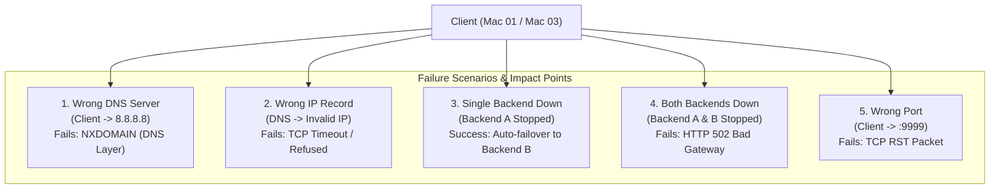
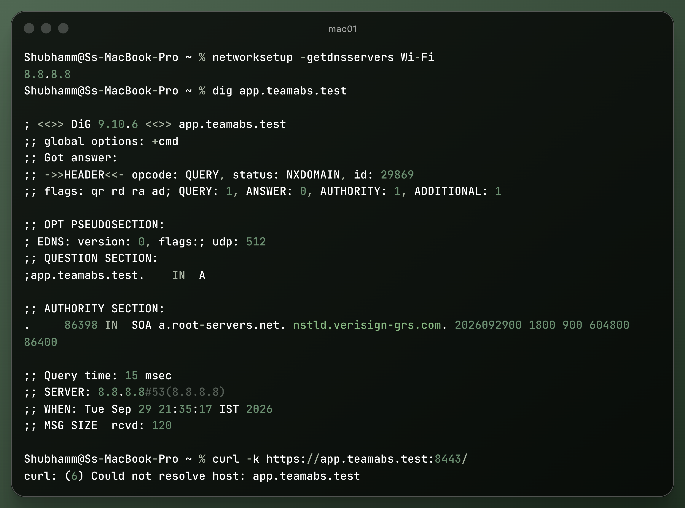
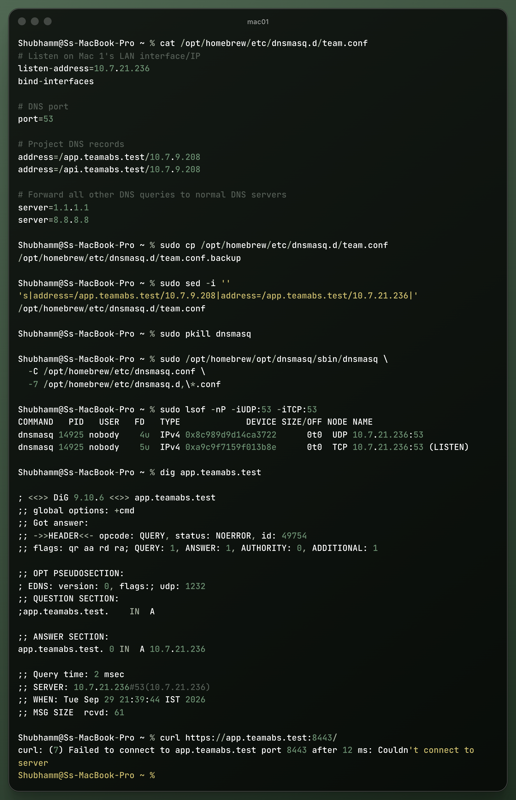
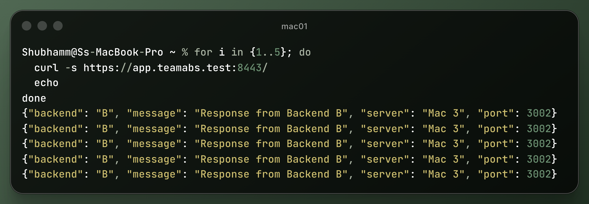
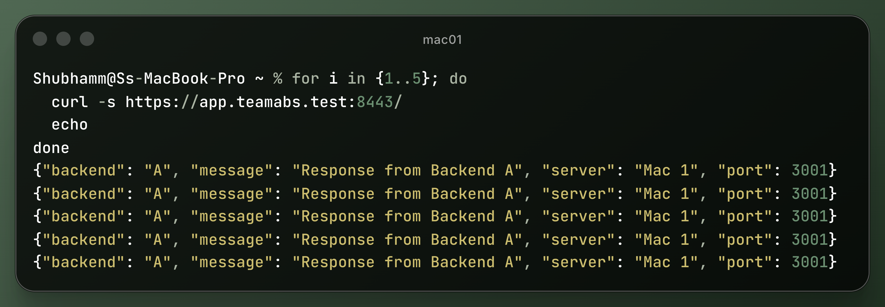
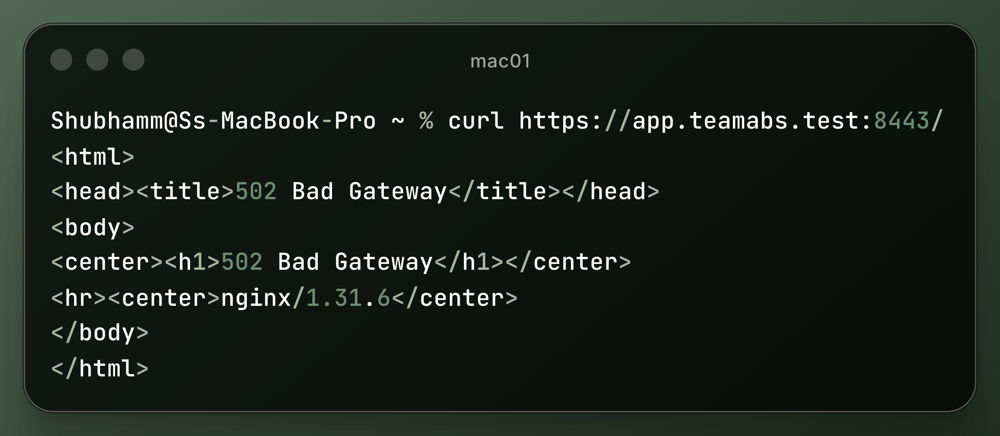
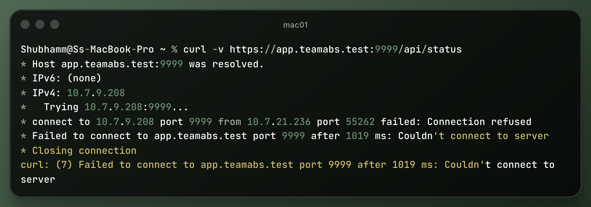

# Task H: Required Failure Demonstrations

This directory details the intentional failure demonstrations, observations, root causes, and networking lessons recorded during Phase 1 testing.



---

## 1. Failure Scenario 1: Wrong DNS Server Configured on Client

### Execution
The client Wi-Fi DNS configuration is switched from the private DNS resolver (`10.7.21.236`) to a public DNS provider:
```bash
sudo networksetup -setdnsservers Wi-Fi 8.8.8.8
dig app.teamabs.test
```

### Observation
- The DNS lookup fails with `NXDOMAIN` or no answer.
- Public resolvers (such as Google `8.8.8.8`) have no knowledge of the private internal `.test` top-level domain.
- Direct ping by IP (e.g. `ping 10.7.9.208`) remains 100% operational.



### Key Lesson
**Separation of Name Resolution and IP Connectivity**: DNS resolution and IP layer routing operate independently. A failure in name resolution halts hostname-based communication despite direct Layer 3 network reachability.

---

## 2. Failure Scenario 2: DNS Record Points to Wrong IP Address

### Execution
The DNS mapping in `dnsmasq.conf` is temporarily altered to an incorrect/unassigned IP address (e.g., `10.7.9.99` instead of `10.7.9.208`):
```bash
dig app.teamabs.test
curl -i https://app.teamabs.test:8443/api/status
```

### Observation
- DNS resolution **succeeds** and returns the incorrect IP address.
- The client then initiates a TCP handshake towards the incorrect IP, resulting in `Operation timed out` (`ETIMEDOUT`) or `Connection refused`.



### Key Lesson
**DNS is Purely a Directory Service**: DNS does not validate whether a service is actually running or reachable at the target IP address. It only translates names into addresses.

---

## 3. Failure Scenario 3: One Backend Is Stopped

### Execution
Backend A (`10.7.21.236:3001`) or Backend B (`10.7.16.91:3002`) is terminated while the other backend remains online:
```bash
curl -i https://app.teamabs.test:8443/api/status
```

### Observation
- Edge reverse proxy (nginx on Mac 02) continues to accept incoming HTTPS connections on port 8443.
- When proxying, nginx routes requests to the healthy active backend node (`X-Backend: B` or `X-Backend: A`). If a request hits the offline backend, standard nginx behavior marks the failed peer and re-routes.

#### Backend A Down Test:


#### Backend B Down Test:


### Key Lesson
**High Availability and Load Balancing Redundancy**: An edge reverse proxy shields clients from individual backend node failures, allowing uninterrupted service while backend maintenance occurs.

---

## 4. Failure Scenario 4: Both Backends Are Stopped

### Execution
Both Backend A (port 3001) and Backend B (port 3002) are shut down:
```bash
curl -i https://app.teamabs.test:8443/api/status
```

### Observation
```http
HTTP/1.1 502 Bad Gateway
Server: nginx/1.31.6
Date: Wed, 30 Sep 2026 18:05:12 GMT
Content-Type: text/html
Content-Length: 157
Connection: keep-alive
```
- DNS resolution for `app.teamabs.test` succeeds.
- TCP 3-way handshake on port 8443 succeeds.
- TLS 1.2 handshake completes and session encryption is established.
- nginx attempts to forward to the upstream backend servers, fails to connect to both, and returns `HTTP 502 Bad Gateway`.



### Key Lesson
**Edge Layer vs. Origin Layer Decoupling**: The TLS termination and reverse proxy layer functions properly even if origin upstream servers are completely unavailable.

---

## 5. Failure Scenario 5: Wrong Destination Port on Client

### Execution
Client makes a request to an unassigned destination port on the edge server:
```bash
curl -v https://app.teamabs.test:9999/api/status
```

### Observation
- DNS correctly resolves `app.teamabs.test` to `10.7.9.208`.
- Client transmits a `[SYN]` packet to `10.7.9.208:9999`.
- Mac 02 kernel recognizes that no process is listening on port 9999 and immediately responds with a `[RST, ACK]` packet.
- curl output:
  ```
  * Connecting to app.teamabs.test (10.7.9.208) port 9999
  * Failed to connect to app.teamabs.test port 9999: Connection refused
  ```



### Key Lesson
**IP Addresses vs. Ports (Layer 3 vs. Layer 4)**: The IP address routes traffic to the physical network interface of a host, while the transport port identifies the specific socket / application process bound on that host.
