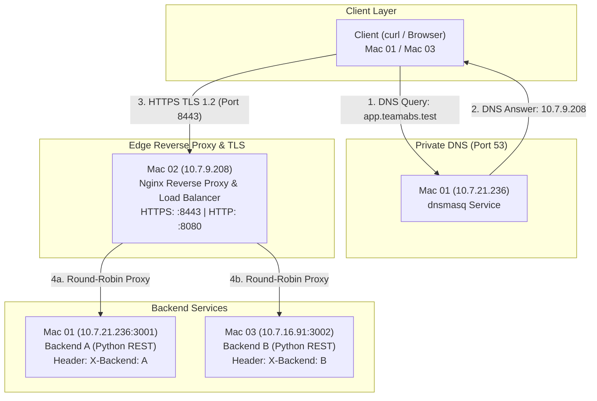

# TeamABS - Computer Networks Project (Phase 1)

This repository contains the complete implementation, configurations, source code, and network analysis for the Phase 1 Computer Networks project by **TeamABS**.

---

## Team Members & Machine Inventory

| Machine | Member | IPv4 Address | Subnet / CIDR | MAC Address | Primary Roles |
|---|---|---|---|---|---|
| **Mac 01** | Shubham Aggarwal | `10.7.21.236` | `255.255.224.0` (`/19`) | `80:a9:97:3d:bd:de` | Private DNS (`dnsmasq`), Test Client, Backend A (`:3001`) |
| **Mac 02** | Atharva Sharma | `10.7.9.208` | `255.255.224.0` (`/19`) | `ae:8a:c0:6b:6f:c8` | Nginx Edge, Reverse Proxy, Load Balancer, TLS Termination (`:8080`, `:8443`) |
| **Mac 03** | Bhavya Punj | `10.7.16.91` | `255.255.224.0` (`/19`) | `22:53:52:98:cf:c9` | Backend B (`:3002`), DNS Client |

- **Network:** `10.7.0.0/19`
- **Subnet Mask:** `255.255.224.0`
- **Default Gateway:** `10.7.0.1`

---

## Architecture Overview



---

## Repository Structure

- [01_Architecture/](01_Architecture/): Network topology diagram and IP inventory assets.
- [02_DNS/](02_DNS/): `dnsmasq.conf` configuration file for the private local DNS resolver.
- [03_Backends/](03_Backends/):
  - [backend_A/server.py](03_Backends/backend_A/server.py): Backend A HTTP/REST microservice running on port `3001`.
  - [Backend_B/server.py](03_Backends/Backend_B/server.py): Backend B HTTP/REST microservice running on port `3002`.
- [04_Nginx/](04_Nginx/):
  - [nginx.conf](04_Nginx/nginx.conf): Nginx upstream load balancer (round-robin) and reverse proxy configuration for ports `8080` and `8443`.
- [05_TLS/](05_TLS/):
  - [nginx_tls.conf](05_TLS/nginx_tls.conf): HTTPS TLS server block configuration.
  - [san.cnf](05_TLS/san.cnf): Subject Alternative Name configuration for OpenSSL certificate generation.
- [06_Caching/](06_Caching/):
  - [cache_headers.txt](06_Caching/cache_headers.txt): Verification logs for `Cache-Control`, `ETag`, and `304 Not Modified` responses.
- [07_Wireshark/](07_Wireshark/):
  - [README.md](07_Wireshark/README.md): Detailed Wireshark packet capture analysis, filter rules, and flow breakdowns across DNS, TCP, TLS, and HTTP.
- [08_Failures/](08_Failures/):
  - [README.md](08_Failures/README.md): Documentation of the 5 required failure injection demonstrations.
- [09_Documentation/](09_Documentation/):
  - [documentation.pdf](09_Documentation/documentation.pdf): Complete 36-page compiled formal report.
  - [README.md](09_Documentation/README.md): High-level project index and task deliverables summary.

---

## Quickstart & Execution Guide

### 1. Start Backend Services
On **Mac 01**:
```bash
python3 03_Backends/backend_A/server.py
```
On **Mac 03**:
```bash
python3 03_Backends/Backend_B/server.py
```

### 2. Start Private DNS Server
On **Mac 01**:
```bash
sudo dnsmasq -C 02_DNS/dnsmasq.conf -d
```
On client machines (Mac 01 / Mac 03), point DNS to Mac 01:
```bash
sudo networksetup -setdnsservers Wi-Fi 10.7.21.236
```

### 3. Generate TLS Certificates & Configure Nginx
On **Mac 02**:
```bash
# Generate Root CA
openssl genrsa -out cn-ca.key 2048
openssl req -x509 -new -nodes -key cn-ca.key -sha256 -days 365 -out cn-ca.crt

# Generate Server CSR and Key
openssl genrsa -out app.teamabs.test.key 2048
openssl req -new -key app.teamabs.test.key -out app.teamabs.test.csr

# Sign Server Certificate with SAN
openssl x509 -req -in app.teamabs.test.csr -CA cn-ca.crt -CAkey cn-ca.key -CAcreateserial \
  -out app.teamabs.test.crt -days 365 -sha256 -extfile 05_TLS/san.cnf

# Move certificates to Nginx SSL directory
sudo mkdir -p /opt/homebrew/etc/nginx/ssl
sudo cp app.teamabs.test.crt /opt/homebrew/etc/nginx/ssl/
sudo cp app.teamabs.test.key /opt/homebrew/etc/nginx/ssl/

# Start/Reload Nginx
sudo nginx -t
sudo nginx -s reload
```

### 4. Verify System End-to-End
```bash
# DNS Resolution Check
dig app.teamabs.test

# HTTP Check (Port 8080)
curl -i http://app.teamabs.test:8080/api/status

# HTTPS Check (Port 8443)
curl -i https://app.teamabs.test:8443/api/status

# Caching 304 Validation
curl -i -H 'If-None-Match: "teamabs-v1"' https://app.teamabs.test:8443/api/status

# Round-Robin Load Balancing Check
for i in {1..10}; do
  curl -s -D - https://app.teamabs.test:8443/api/status -o /dev/null | grep -i '^X-Backend:'
done
```